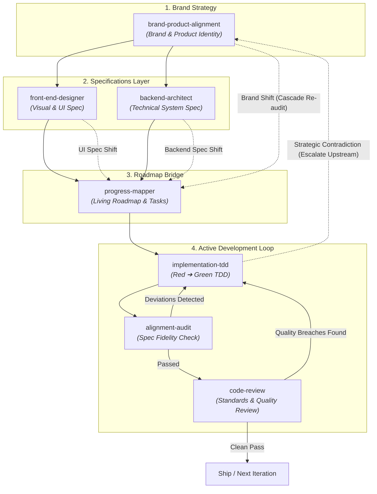

# Agentic Development Loop

This skill defines and orchestrates the **Continuous Agentic Development Loop**. Development is not a one-way linear pipeline; it is a bi-directional feedback loop where audit failures, code review findings, or mid-flight strategic requirement shifts cycle back upstream until quality, spec fidelity, and brand alignment are locked.

---

## The Development Loop Architecture

---

## Upstream Cascade & Mid-Flight Re-alignment Protocol

Development requirements inevitably shift during real-world execution. The agent must handle bi-directional upstream flow:

### 1. Downstream Cascade Re-Audit (Top-Down Shift)
- **Brand/Product Shift**: If `brand-product-alignment-spec.md` is updated mid-flight, downstream dependent specs (`front-end-design-spec.md`, `backend-architecture-spec.md`) and `progress-map.md` are automatically flagged for a **Cascade Re-Audit**.
- **Backend/Front-End Spec Shift**: If `backend-architecture-spec.md` or `front-end-design-spec.md` is modified, `progress-mapper` automatically re-audits `progress-map.md` to update dependent tasks/sub-tasks.

### 2. Upstream Strategic Escalation (Bottom-Up Escalation)
- If during `implementation-tdd`, `alignment-audit`, or `code-review` an unresolvable technical contradiction, impossible SLA trade-off, or fundamental brand mismatch is discovered, the agent must **escalate back UP**:
  - Escalate to `backend-architect` to resolve infrastructure contradictions.
  - Escalate to `brand-product-alignment` to resolve fundamental positioning or boundary mismatches.

### 3. Progress Mapper Re-alignment
- Whenever an upstream spec is modified or an upstream escalation occurs, `progress-mapper` ingests the updated spec, invalidates impacted roadmap items, reopens affected completed phases (`[x]` ➔ `[ ] Reopened: [Reason]`), and injects updated atomic TDD sub-tasks into `progress-map.md`.

---

## Loop Dynamics & Skill Responsibilities

### Phase 1: Brand & Product Alignment Layer
1. **`brand-product-alignment`**: Focuses purely on brand-product positioning, product vibe, 3-second impression, boundaries (*what it is vs. what it is not*), and blacklisted clichés. Generates `brand-product-alignment-spec.md`.

### Phase 2: Technical Specification & Roadmap Layer
2. **Technical Spec Branching**:
   - **`backend-architect`**: Establishes **Technical System Specifications**, data ownership, API paradigms, reliability targets, and backend technical moats. Generates `backend-architecture-spec.md`.
   - **`front-end-designer`**: Establishes **Front-End Visual Specifications**, opinionated typography, universal component moats, 2nd/3rd idea UI concepts, and interactive physics. Generates `front-end-design-spec.md`.
3. **`progress-mapper` (Roadmap & Progress Bridge)**:
   - Ingests spec artifacts (`brand-product-alignment-spec.md`, `front-end-design-spec.md`, `backend-architecture-spec.md`) and breaks them down into a living roadmap of Milestones, Tasks, and atomic `implementation-tdd` sub-tasks stored in `progress-map.md`.

### Phase 3: Active Development Loop (Iterative Core)
4. **`implementation-tdd`**: Execute artifact-driven TDD (Red ➔ Green). Select the next pending sub-task from `progress-map.md`, write failing tests mapping to specs, then write minimal code to pass them.
5. **`alignment-audit`**: Audit the diff against technical/brand spec artifacts for plan fidelity, missing deliverables, or scope creep.
   - **Loop Trigger**: If `alignment-audit` reports `DEVIATION DETECTED`, cycle back immediately to `implementation-tdd` to fulfill missing specs or revert unapproved changes.
6. **`code-review`**: Perform a parallel two-axis review (Standards & Spec) evaluating code quality, Fowler smells, and edge-case robustness.
   - **Loop Trigger**: If `code-review` reports quality breaches, unhandled exceptions, or architectural smells, cycle back to `implementation-tdd` to adjust tests and refactor logic. Upon **Clean Pass**, mark the sub-task complete `[x]` in `progress-map.md`.

### Cross-Cutting Skill: `explain-and-teach`
- **`explain-and-teach`**: Can fire at **any point** in the development loop whenever the user asks *"why"*, requests rationale, or wants to understand trade-offs. Adapts dynamically to deliver ONLY the requested slice (Trade-offs, Ripple Effects, or Mental Models) without forcing a rigid full-lecture template.

### Phase 4: Loop Exit & Completion
- Once both `alignment-audit` (Plan Fidelity) and `code-review` (Quality & Robustness) report **Clean Pass**, the iteration loop closes.
- The feature is ready for merge/ship, and the agent initiates the next development loop iteration.
