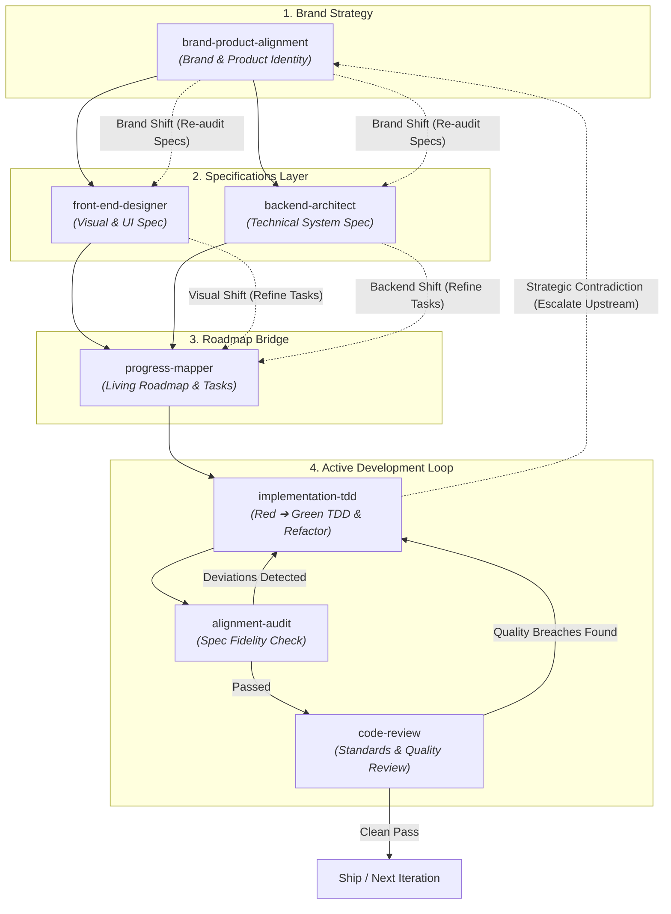

# Agentic Development Loop

This skill defines and orchestrates the **Continuous Agentic Development Loop**. Development is not a one-way linear pipeline; it is a bi-directional feedback loop where audit failures, code review findings, or mid-flight strategic requirement shifts cycle back upstream until quality, spec fidelity, and brand alignment are locked.

---

## The Development Loop Architecture



---

## Canonical 5-Layer Context Chain Schema

To eliminate context drift across skills, every downstream execution step (`implementation-tdd`, `alignment-audit`, `code-review`) ingests and updates a standardized **5-Layer Context Chain**:

```markdown
1. Product & Brand Understanding: App purpose, target audience, brand positioning, and core boundaries.
2. Active Branch & Target Scope: Current Git branch (e.g. `feat/auth-flow`), target milestone, and optional tracker issue (`#123`).
3. Phase Objective: The specific high-level capability or architectural goal for the current cycle.
4. Active Task & Spec Contracts: Target sub-task requirements from `progress-map.md` and spec artifacts (`brand-product-alignment-spec.md`, `front-end-design-spec.md`, `backend-architecture-spec.md`).
5. Execution & Harness Constraints: Test runner configuration, diff boundary (`git diff main...HEAD`), and active audit constraints.
```

---

## Execution State Machine & Decision Gates

| Current State | Condition / Event | Next Action / Target Skill | Guard / Exit Criteria |
| :--- | :--- | :--- | :--- |
| **New Feature / Refactor Request** | No specs exist OR specs need update | Route to `brand-product-alignment`, `front-end-designer`, or `backend-architect` | Approved spec artifacts committed in `docs/specs/` |
| **Specs Approved** | Specs ready for roadmap breakdown | Route to `progress-mapper` | `progress-map.md` generated with atomic sub-tasks |
| **Roadmap Ready** | Next pending sub-task selected | Route to `implementation-tdd` | Red commit (`test(...)`) followed by Green commit (`feat(...)`) |
| **TDD Complete** | Code implementation passing tests | Route to `alignment-audit` | Audits diff vs specs. Checks for missing items or scope creep |
| **Audit: DEVIATION DETECTED** | Spec blocker (🔴 Critical / 🟡 High) | Cycle back to `implementation-tdd` | Implement missing spec or revert unapproved changes |
| **Audit: PASSED** | 100% spec coverage verified | Route to `code-review` | Spawns dual sub-agents (Code Health & "What-If" Stress Test) |
| **Review: ISSUES FOUND** | Quality breach (🔴 Critical / 🟡 High) | Cycle back to `implementation-tdd` (Refactor Mode) | Fix code smells / edge cases without breaking passing tests |
| **Dual Clean Pass** | Both Audit & Review PASSED | Ship / Close Task | Mark task complete in `progress-map.md` with commit SHA |

---

## Rollback & Fix-Forward Protocol

When an audit or review fails, apply the appropriate recovery strategy based on severity:

1. **Fix-Forward (Default for Minor Gaps & Refactoring)**:
   - For 🔵 Medium / ⚪ Low gaps or `code-review` quality findings, fix forward on the current feature branch with new commits (`refactor(...)` or `fix(...)`).
2. **Revert & Rescope (For Critical Scope Creep or Unapproved Pivots)**:
   - For 🔴 Critical scope creep or unapproved architectural changes flagged by `alignment-audit`, run `git revert` on the offending commits or reset the branch, re-align with the spec, and re-implement cleanly.

---

## Upstream Cascade & Mid-Flight Re-alignment Protocol

Development requirements inevitably shift during real-world execution. The agent must handle bi-directional upstream flow:

### 1. Downstream Cascade Re-Audit (Top-Down Shift)
- **Brand/Product Shift**: If `brand-product-alignment-spec.md` is updated mid-flight, downstream dependent specs (`front-end-design-spec.md`, `backend-architecture-spec.md`) are automatically flagged for a **Cascade Re-Audit**. Once the technical specs are updated, `progress-mapper` is invoked to refine `progress-map.md`.
- **Backend/Front-End Spec Shift**: If `backend-architecture-spec.md` or `front-end-design-spec.md` is modified, `progress-mapper` automatically re-audits `progress-map.md` to update dependent tasks/sub-tasks.

### 2. Upstream Strategic Escalation (Bottom-Up Escalation)
- If during `implementation-tdd`, `alignment-audit`, or `code-review` an unresolvable technical contradiction, impossible SLA trade-off, or fundamental brand mismatch is discovered, the agent must **escalate back UP**:
  - Escalate to `backend-architect` to resolve infrastructure contradictions.
  - Escalate to `brand-product-alignment` to resolve fundamental positioning or boundary mismatches.

### 3. Progress Mapper Re-alignment
- Whenever an upstream spec is modified or an upstream escalation occurs, `progress-mapper` ingests the updated spec, invalidates impacted roadmap items, reopens affected completed phases (`[x]` ➔ `[ ] Reopened: [Reason]`), and injects updated atomic TDD sub-tasks into `progress-map.md`.

---

## End-to-End Git & Release Workflow Integration

The entire agentic development loop operates natively over Git version control, feature branches, and Pull Requests:

1. **Feature Branch Isolation**: Development work is isolated on dedicated feature branches (`git checkout -b feat/task-name`).
2. **Version-Controlled Specs**: Discovery artifacts (`brand-product-alignment-spec.md`, `front-end-design-spec.md`, `backend-architecture-spec.md`, `progress-map.md`) are committed under `docs/specs/` or repo root.
3. **Atomic Red-Green Commits**: `implementation-tdd` produces explicit `test(...)` Red commits followed by `feat(...)` Green commits (and `refactor(...)` commits when fixing review findings).
4. **PR Audit & Review Gates**: `alignment-audit` and `code-review` evaluate `git diff origin/main...HEAD` before PR merge.
5. **Merge & Milestone Closure**: Upon dual Clean Pass, `progress-map.md` is updated with commit SHAs (`[x] Sub-Task 1.1.1 (Commit: a1b2c3d)`), and the PR is approved for merge.

---

## Loop Dynamics & Skill Responsibilities

### Phase 1: Brand & Product Alignment Layer
1. **`brand-product-alignment`**: Focuses purely on brand-product positioning, product vibe, 3-second impression, boundaries (*what it is vs. what it is not*), and blacklisted clichés. Generates `brand-product-alignment-spec.md`.

### Phase 2: Technical Specification & Roadmap Layer
2. **Technical Spec Branching**:
   - **`backend-architect`**: Establishes **Technical System Specifications**, data ownership, API paradigms, reliability targets, and backend technical moats. Generates `backend-architecture-spec.md`.
   - **`front-end-designer`**: Establishes **Front-End Visual Specifications**, opinionated typography, universal component moats, 2nd/3rd idea UI concepts, and interactive physics. Generates `front-end-design-spec.md`.
3. **`progress-mapper` (Roadmap & Progress Bridge)**:
   - Ingests spec artifacts (`brand-product-alignment-spec.md`, `front-end-design-spec.md`, `backend-architecture-spec.md`) and breaks them down into a living roadmap of Milestones, Tasks, and atomic `implementation-tdd` sub-tasks stored in `progress-map.md`.

### Phase 3: Active Development Loop (Iterative Core)
4. **`implementation-tdd`**: Execute artifact-driven TDD (Red ➔ Green) and Refactoring. Select the next pending sub-task from `progress-map.md`, write failing tests mapping to specs, write minimal code to pass them, and refactor when returning from review.
5. **`alignment-audit`**: Audit the diff against technical/brand spec artifacts for plan fidelity, missing deliverables, or scope creep.
   - **Loop Trigger**: If `alignment-audit` reports `DEVIATION DETECTED`, cycle back immediately to `implementation-tdd` to fulfill missing specs or revert unapproved changes.
6. **`code-review`**: Perform a parallel two-axis review (Standards & Spec) evaluating code quality, Fowler smells, and edge-case robustness.
   - **Loop Trigger**: If `code-review` reports quality breaches, unhandled exceptions, or architectural smells, cycle back to `implementation-tdd` (Refactor Mode) to adjust tests and refactor logic. Upon **Clean Pass**, mark the sub-task complete `[x]` in `progress-map.md`.

### Cross-Cutting Skill: `explain-and-teach`
- **`explain-and-teach`**: Can fire at **any point** in the development loop whenever the user asks *"why"*, requests rationale, or wants to understand trade-offs. Adapts dynamically to deliver ONLY the requested slice (Trade-offs, Ripple Effects, or Mental Models) without forcing a rigid full-lecture template.

### Phase 4: Loop Exit & Completion
- Once both `alignment-audit` (Plan Fidelity) and `code-review` (Quality & Robustness) report **Clean Pass**, the iteration loop closes.
- The feature is ready for merge/ship, and the agent initiates the next development loop iteration.

