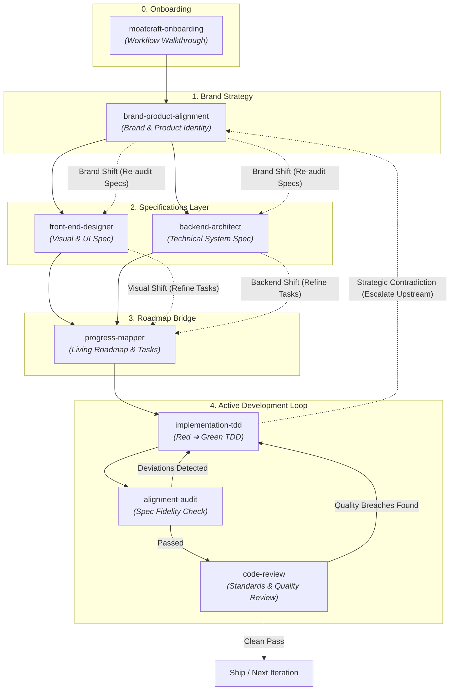

# Moatcraft

> **Opinionated Agentic Skills for Crafting Defensible Software and Architectural Moats**

[](https://skills.sh/dimsedra/moatcraft-skills)

Moatcraft is a suite of production-grade agent skills designed to guide AI coding assistants through a continuous development loop. It eliminates commodity UI templates, generic happy-path solutions, and sycophantic behavior, focusing instead on building defensible design moats, resilient backend architectures, and artifact-driven TDD execution.

---

## Installation

Install the entire suite or individual skills using the open `skills` CLI:

### Install All Skills
```bash
npx skills add dimsedra/moatcraft-skills
```

### Install Specific Skill
```bash
npx skills add dimsedra/moatcraft-skills@moatcraft-onboarding
```

---

## Development Loop Architecture



---

## Skill Specifications

| Skill | Category | Description | Primary Output Artifact |
| :--- | :--- | :--- | :--- |
| **`moatcraft-onboarding`** | Onboarding | Walks new users through the Moatcraft workflow AND integrates the environment into their project — adapted per project state (clean slate, mid-development, workflow migration). | Spec directory, inferred specs, git conventions |
| **`brand-product-alignment`** | Strategy | Conducts fluid brand and product discovery to define positioning, identity boundaries, and experience moats. | `brand-product-alignment-spec.md` |
| **`front-end-designer`** | Front-End | Applies opinionated UI rules, breathable visual hierarchy, 2nd/3rd idea iteration, and universal component moats. | `front-end-design-spec.md` |
| **`backend-architect`** | Back-End | Conducts natural, jargon-free backend discovery for data flow, operational limits, SLAs, and technical moats. | `backend-architecture-spec.md` |
| **`progress-mapper`** | Roadmap | Ingests brand/technical specs and decomposes them into a living roadmap of Milestones, Tasks, and atomic TDD sub-tasks. | `progress-map.md` |
| **`implementation-tdd`** | Execution | Executes artifact-driven Red-Green TDD focusing strictly on functional compliance without premature optimization. | Passing Test Suite & Code |
| **`alignment-audit`** | Audit | Upstream auditor running before code review to catch plan deviations, missing deliverables, or scope creep, categorized by urgency level with explicit "WHY" impact rationales. | `alignment-audit-report.md` |
| **`code-review`** | Quality | Spawns parallel sub-agents to conduct two-axis review (Standards & Spec) targeting code smells and edge-case robustness, categorized by urgency level with explicit "WHY" rationales. | Dual-Axis Review Report |
| **`explain-and-teach`** | Cross-Cutting | Delivers adaptive, systemic explanations (Trade-offs, Ripple Effects, Mental Models) tailored for systemic thinkers. | Direct Response |
| **`agentic-dev-loop`** | Router | Orchestrates the continuous feedback loop between strategic discovery, roadmap planning, TDD execution, auditing, and review. | Loop Orchestration |

---

## Operating Principles

1. **Happy-Path Rejection**  
   Initial design and architecture proposals are often paths of least resistance. Moatcraft skills push past generic solutions to uncover unique, brand-anchored concepts through 2nd and 3rd iterations.

2. **Fluid Conversation and Behind-the-Scenes Checklists**  
   Discovery skills (`brand-product-alignment` and `backend-architect`) avoid rigid questionnaires. Dialogue flows naturally like technical partners at a whiteboard while tracking required parameters on behind-the-scenes checklists.

3. **Anti-Sycophancy Protocol**  
   Agents maintain the explicit obligation to challenge unexamined assumptions, point out logical or technical contradictions, and offer proactive alternative recommendations.

4. **Objective Context Ingestion and Sub-Agent Independence**  
   Sub-agents operate autonomously. The main agent synthesizes and provides a neutral 5-Layer Context Chain (Product ➔ Phase ➔ Objective ➔ Task ➔ Review Scope) without dictating conclusions.

5. **Adaptive Modular Explanations**  
   `explain-and-teach` delivers only the specific slice requested (Trade-offs, Ripple Effects, or First-Principles Mental Models) without forcing unrequested lengthy lectures.

---

## License

MIT License. Developed for the Open Agent Skills Ecosystem.
